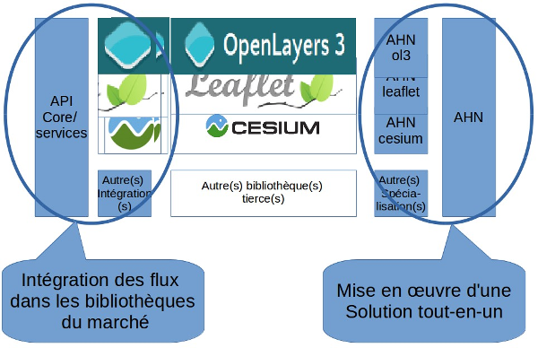

# Contexte

La version 3 de l'API Géoportail se décline selon une offre logicielle à trois niveaux :

1. Un premier niveau qui couvre l'accès aux référentiels Géoportail et prend en charge l'accès aux services spécifiques de la plateforme Géoportail indépendamment de toute bibliothèque cartographique.

2. Un second niveau qui intègre le premier et propose des intégrations des services de la plateforme Géoportail (spécifiques ou standards) dans les bibliothèques du marché via leurs mécanismes propres d'extension. Des lots de composants graphiques peuvent être aussi proposés pour chacune des bibliothèques supportées, déclinés selon une identité visuelle commune.

3. Un troisième niveau qui intègre les deux niveaux précédents et offre une solution « clé en main » d'intégration d'une carte dans une page web en s'appuyant sur une ou plusieurs bibliothèques du marché prises sur étagère.

Le Kit de développement (appelé aussi API « Haut Niveau » dans ce document) a pour but la mise en oeuvre de ce troisième niveau.

