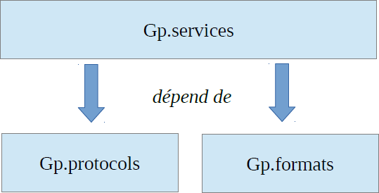

# Description détaillée

## Namespace

Le namespace lié à l'API Géoportail Services est « Gp ».

## Découpage fonctionnel

L'API Géoportail Services se décompose en trois blocs fonctionnels :

* un bloc de gestion des protocoles d'accès aux services, accessible derrière le package « Gp.protocols » ;
* un bloc de gestion de l'accès aux services (interrogation des services), regroupé dans le package « Gp.services » ;
* un bloc de gestion des formats relatifs aux services (exploitation des réponses brutes des services pour les restituer dans les formats offerts par l'API), disponible derrière le package « Gp.formats ».

Les dépendances entre ces blocs sont les suivantes :

