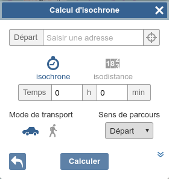
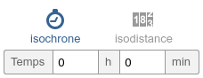
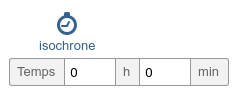
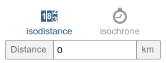

# Widget de calcul et d'affichage d'isochrones / isodistances

## Présentation générale

### Utilisation par l'internaute

Le widget se présente sous la forme d'un formulaire (minimisable / maximisable) permettant de saisir les paramètres nécessaires au lancement d'un calcul d'isochrones (point de départ ou d'arrivée, mode de calcul, ...).

La saisie du point de départ ou d'arrivée doit pouvoir se faire par intéraction avec la carte, par géocodage (géocodeur IGN) ou par saisie directe de coordonnées.

Une fois l'isochrone/distance obtenue celle-ci est affichée sur la carte.

### Utilisation par un développeur

la création du widget permet au développeur :

* d'accrocher les différents éléments graphiques (formulaire de saisie) à la page html via le mécanisme standard des CSS,
* de rendre visibles ou non des élements du formulaire à l'internaute,
* d'activer / désactiver certains modes de saisie des points pour le calcul,
* de fixer des valeurs par défaut de certains paramètres de calcul d'iso.

Le développeur peut agir sur l'état (maximisé / minimisé) du widget

## Spécification détaillée

### Utilisation

Ce widget se comporte comme un contrôle d'OpenLayers (ol.control.Control), il faut donc instancier un objet ol.control.Isocurve puis l'ajouter à sa carte OpenLayers.

``` javascript
var isoControl = ol.control.Isocurve(opts);
map.addControl(isoControl);
```

### Options

Le paramètre **opts** est un objet, dont les propriétés peuvent prendre les valeurs suivantes (en plus des [options du contrôle OpenLayers](http://openlayers.org/en/v3.14.2/apidoc/ol.control.Control.html)) :

Paramètre     |  Type    |    Opt.   | Valeur
-|-|-|-|
apiKey              | String  | Conditionnel | Clef API utilisée pour l’utilisation des services d'autocomplétion et de calcul d'isochrones du Géoportail. Nécessaire si l'autoconfiguration n'a pas été chargée au préalable.
collapsed           | Boolean | Optionnel | Permet de spécifier si le widget doit être déplié au démarrage de l'application (collapsed = false), ou replié (collapsed = true). Plié par défault (true).
exclusions          | Object  | Optionnel | Liste des exclusions à afficher dans le panneau de calcul d'isochrones, avec leurs status par défaut :  true signifie que l'exclusion sera initialement sélectionnée (passage non autorisé), false signifie qu'elle ne sera pas sélectionnée (passage autorisé)
graphs              | Array   | Optionnel | Liste des modes de transport à proposer pour le calcul d'isochrones : "Voiture" ou "Pieton". Le premier élément de la liste est celui qui sera sélectionné par défaut. Par défaut : ["Voiture", "Pieton"]
methods             | Array   | Optionnel | Liste des modes de calcul à proposer pour le calcul d'isochrones : "time" (calcul d'isochrones) ou "distance" (calcul d'isodistance). Le premier élément de la liste est celui qui sera sélectionné par défaut. Par défaut : ["time", "distance"]
directions          | Array   | Optionnel | Liste des sens de parcours à proposer pour le calcul d'isochrones : "departure" (le point saisi est le départ du parcours) ou "arrival" (point d'arrivée du parcours). Le premier élément de la liste est celui qui sera sélectionné par défaut. Par défaut : ["departure", "arrival"]
isocurveOptions     | Object  | Optionnel | Options du service de calcul d'isochrones, tel que paramétrable via la bibliothèque d'accès (Gp.Services.isoCurve). Voir http://horus.ign.fr/specs-apiv3/bibacces/dd_services_isochrone.html pour connaître l'ensemble des options.
autocompleteOptions | Object  | Optionnel | Options du service d'autocomplétion, tel que paramétrable via la bibliothèque d'accès (Gp.Services.autoComplete). Voir http://horus.ign.fr/specs-apiv3/bibacces/dd_services_autocompletion.html pour connaître l'ensemble des options.

### Exemple simple d'utilisation :

``` javascript
var isoControl = ol.control.Isocurve({
    collapsed : false,
    apiKey : "MaCleAPI"
});
map.addControl(isoControl);
```

Ce qui donne :


### Exemples de paramétrages possibles

#### Mode de calcul : option **methods**

Le développeur peut choisir d'afficher ou non les différentes options du calcul d'isochrones. Par exemple, il peut choisir d'afficher les modes de calcul : isodistance ou isochrone.
Par défaut, les modes "time" (isochrone) et "distance" (isodistance) sont proposés dans cet ordre, et c'est le mode isochrone qui est sélectionné :



Si le développeur ne souhaite proposer que des calculs d'isochrones :

``` javascript
opts.methods = ["time"];
```


Ou s'il souhaite que le calcul d'isodistance soit sélectionné par défaut :

``` javascript
opts.methods = ["distance", "time"];
```



#### Mode de transport : option **graphs**

Le développeur peut aussi choisir les mode de transport (= graphes sur lesquels se basent le calcul d'isochrones), que l'utilisateur pourra sélectionner.
Par défaut, les modes "Voiture" et "Pieton" sont proposés, et c'est le mode "Voiture" qui est sélectionné :


Si le développeur ne souhaite afficher que le mode de transport "Voiture" :

``` javascript
opts.graphs = ["Voiture"];
```


Ou s'il souhaite que le mode "Pieton" soit sélectionné par défaut :

``` javascript
opts.graphs = ["Pieton", "Voiture"];
```
Ce qui donnera :


#### Passages non autorisés : option **exclusions**

Le développeur peut aussi choisir les exclusions (= passages non autorisés) que l'utilisateur pourra sélectionner.
Par défaut, les exclusions "Tunnel", "Péages" et "Ponts" sont proposés, et sont tous les trois sélectionnés, c'est-à-dire que ces passages sont autorisés (exclusions non prises en compte).

Code équivalent au comportement par défaut :

``` javascript
opts.exclusions = {
    tunnel : false,
    toll : false,
    bridge : false
};
```

Le rendu sera alors le suivant :


#### Configuration des services

Pour calculer l'isochrone (ou isodistance), le widget se base sur le service de calcul d'isochrones du Géoportail. L'appel à ce service est paramétrable (protocol, serverUrl), avec les mêmes options que le service de calcul d'isochrones proposé dans la bibliothèque d'accès : [Gp.Services.isoCurve](./../bibacces/dd_services_isochrone.html).
Attention : certains paramètres spécifiques au calcul d'isochrones sont surchargés par le widget pour son bon fonctionnement, et ne seront donc pas pris en compte (position, method, graph, etc).

``` javascript
opts.isocurveOptions = {
    // options de Gp.Services.isoCurve()
};
```

De même, le widget se base sur le service d'autocomplétion du Géoportail lors de la recherche d'un lieu. Ce service est lui aussi paramétrable, avec les mêmes options que le service d'autocomplétion proposé dans la bibliothèque d'accès : [Gp.Services.autocomplete](./../bibacces/dd_services_autocompletion.html).

``` javascript
opts.autocompleteOptions = {
    // options de Gp.Services.autocomplete()
};
```
Remarque :

* lorsque la propriété **apiKey** est renseignée dans les options de l'un des deux services, elle surcharge systématiquement celle du contrôle. On peut donc spécifier deux clés différentes, une pour chaque service.

## Ergonomie


<div id="viewerDiv">

            <div class="ol-zoom">
                <button class="ol-zoom-in" type="button" title="Zoom in">+</button>
                <button class="ol-zoom-out" type="button" title="Zoom out">−</button>
            </div>

            <!-- ISOCHRON -->

            <div id="GPisochron" class="GPwidget">

                <!-- Hidden checkbox for minimizing/maximizing -->
                <input type="checkbox" id="GPshowIsochron" />
                <label for="GPshowIsochron" id="GPshowIsochronPicto" class="GPshowAdvancedToolPicto" title="Calculer une isochrone">
                    <span id="GPshowIsochronOpen" class="GPshowAdvancedToolOpen"></span>
                </label>

                <!-- Isochron panel -->
                <div id="GPisochronPanel" class="GPpanel">

                    <div class="GPpanelHeader">
                        <div class="GPpanelTitle">Calcul d'isochrone</div>
                        <div id="GPisochronPanelClose" class="GPpanelClose" title="Fermer le panneau"></div>
                    </div>

                    <form id="GPisochronForm">

                        <!-- Origin input -->
                        <div class="GPflexInput">
                            <label id="GPisochronOriginLabel" for="GPisochronOrigin">Départ</label>
                            <input id="GPisochronOrigin" class="GPisochronOriginVisible" type="text" placeholder="Saisir une adresse" />
                            <input id="GPisochronOriginCoords" class="GPisochronOriginHidden" type="text" disabled />
                            <input id="GPisochronOriginPointer" type="checkbox" />
                            <label class="GPisochronOriginPointerImg" for="GPisochronOriginPointer" title="Pointer un lieu sur la carte"></label>
                        </div>

                        <!-- Autocomplete list -->
                        <div id="GPisochronAutoCompleteList" class="GPadvancedAutoCompleteList">
                            <!-- Proposals are dynamically filled in Javascript by autocomplete service -->
                            <div class="GPautoCompleteProposal">17000 La Rochelle</div>
                            <div class="GPautoCompleteProposal">94165 Saint Mandé</div>
                            <div class="GPautoCompleteProposal">Une proposition super longue exprès pour voir ce que ça fait si ça déborde</div>
                            <div class="GPautoCompleteProposal">What else ?</div>
                            <div class="GPautoCompleteProposal">Last and surely least</div>
                        </div>

                        <!-- Choice isochron / isodistance -->
                        <div id="GPisochronChoice">
                            <div class="GPisochronChoiceAlt">
                                <input type="radio" id="GPisochronChoiceAltChron" name="GPisochronChoiceMode" value="isochron" checked>
                                <label class="GPisochronChoiceAltImg" for="GPisochronChoiceAltChron"></label>
                                <span id="GPisochronChoiceAltChronTxt">isochrone</span>
                            </div>
                            <div class="GPisochronChoiceAlt">
                                <input type="radio" id="GPisochronChoiceAltDist" name="GPisochronChoiceMode" value="isodistance">
                                <label class="GPisochronChoiceAltImg" for="GPisochronChoiceAltDist"></label>
                                <span id="GPisochronChoiceAltDistTxt">isodistance</span>
                            </div>
                        </div>

                        <!-- Isochron input values -->
                        <div id="GPisochronValueChron" class="GPflexInput">
                            <label id="GPisochronValueChronLabel" for="GPisochronValueChronInput">Temps</label>
                            <input id="GPisochronValueChronInput1" type="number" value="0" min="0" step="1"/>
                            <label>h</label>
                            <input id="GPisochronValueChronInput2" type="number" value="0" min="0" max="59" step="1"/>
                            <label>min</label>
                        </div>

                        <!-- Isodistance input values -->
                        <div id="GPisochronValueDist" class="GPisochronValueHidden">
                            <label id="GPisochronValueDistLabel" for="GPisochronValueDistInput">Distance</label>
                            <input id="GPisochronValueDistInput" type="number" value="0" min="0" step="any" />
                            <label>km</label>
                        </div>

                        <!-- Computation modes -->
                        <div id="GPisochronModeChoice">
                            <div id="GPisochronTransportChoice">
                                <span class="GPisochronModeLabel">Mode de transport</span>
                                <input type="radio" id="GPisochronTransportCar" name="GPisochronTransport" value="car" checked>
                                <label class="GPisochronTransportImg" for="GPisochronTransportCar" title="Voiture"></label>
                                <input type="radio" id="GPisochronTransportPedestrian" name="GPisochronTransport" value="pedestrian">
                                <label class="GPisochronTransportImg" for="GPisochronTransportPedestrian" title="Piéton"></label>
                            </div>
                            <div id="GPisochronDirectionChoice">
                                <span class="GPisochronModeLabel">Sens de parcours</span>
                                <select id="GPisochronDirectionSelect" class="GPinputSelect">
                                    <option>Départ</option>
                                    <option>Arrivée</option>
                                </select>
                            </div>
                        </div>

                        <!-- Input button -->
                        <input type="submit" id="GPisochronSubmit" class="GPinputSubmit" value="Calculer" />

                    </form>

                    <div id="GPisochronCalcWaitingContainer" class="GPisochronCalcWaitingContainerHidden">
                        <p class="GPisochronCalcWaiting">Calcul en cours...</p>
                    </div>

                </div>

            </div>

</div>
