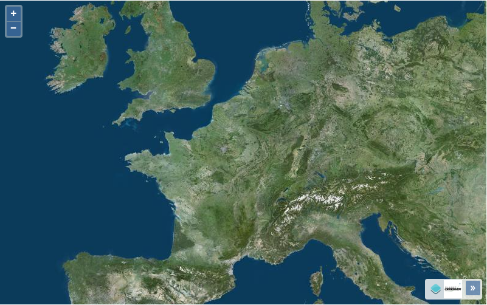
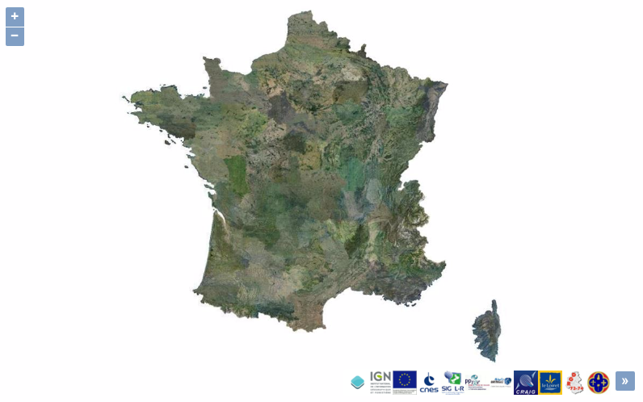

# Widget d'affichage des logos des couches Géoportail

## Présentation générale

Ce widget permet d'afficher, dans une carte OL3, les logos des producteurs des données de la carte, en prenant en compte les déplacements dans la carte ou les changements de zoom, pour modifier dynamiquement les logos selon les zones visibles.

Ce widget fonctionne pour les couches Géoportail, ajoutées à l'aide de la [fonctionnalité d'affichage simple de couche WMS](./ol3-WMS.html) [ou WMTS](./ol3-WMS.html) du Géoportail. Pour les couches ajoutées directement avec OpenLayers 3, seules les attributions spécifiées à la création de la couche seront affichées.

Le bénéfice des fonctionnalités additionnelles de ce controle est conditionné au [chargement préalable de la configuration associée à sa clef de contrat](./ol3-autoconf.html).


## Mise en oeuvre

Ce widget est une extension du contrôle existant d'OpenLayers 3 [ol.control.Attribution](http://openlayers.org/en/v3.13.0/apidoc/ol.control.Attribution.html).

L'utilisation du contrôle se fait de la même manière que pour les autres contrôles OpenLayers : par la création d'un nouveau contrôle ol.control.GeoportalAttribution et son ajout à la carte ol.Map.

``` javascript
new ol.control.GeoportalAttribution(ol3Options);
```

Le paramètre **ol3Options** est un objet, dont les propriétés sont les mêmes que pour créer le contrôle [ol.control.Attribution](http://openlayers.org/en/v3.13.0/apidoc/ol.control.Attribution.html) :


Paramètre     |  Type    |    Opt.   | Valeur
-|-|-|-|
className     | String   | Optionnel | CSS class name. Default is ol-attribution.
target        | Element  | Optionnel | Specify a target if you want the control to be rendered outside of the map's viewport.
collapsible   | Boolean  | Optionnel | Specify if originators can be collapsed. If you use an OSM source, should be set to false — see OSM Copyright — Default is true.
collapsed     | Boolean  | Optionnel | Specify if originators should be collapsed at startup. Default is true.
tipLabel      | String   | Optionnel | Text label to use for the button tip. Default is Attributions
label         | String   | Optionnel | Text label to use for the collapsed attributions button. Default is i. Instead of text, also a Node (e.g. a span element) can be used.
collapseLabel | String   | Optionnel | Function called when the control should be re-rendered. This is called in a requestAnimationFrame callback.
render        | Function | Optionnel | Function called when the control should be re-rendered. This is called in a requestAnimationFrame callback.

### Exemple d'utilisation

Ajout du contrôle après création d'une carte avec une couche WMTS du Géoportail.

``` javascript
var map = new ol.Map({
  target: 'map',
  layers: [
    new ol.layer.Tile({
      source: new ol.source.geoportalWMTS({
        layer: "ORTHOIMAGERY.ORTHOPHOTOS"
      }),
      opacity: 0.7
    })
  ],
  view: new ol.View({
    center: [288074.8449901076, 6247982.515792289],
    zoom: 12
  })
});
map.addControl(
    new ol.control.GeoportalAttribution({
        collapsed : false
    }
));
```

Exemples de rendu : 




