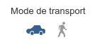
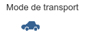
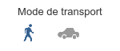
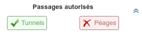

# Widget de calcul d'itinéraire à l'aide du Géoportail

## Présentation générale

### Utilisation par l'internaute

Le widget se présente sous la forme d'un formulaire (minimisable / maximisable) permettant de saisir les paramètres nécessaires au lancement d'un calcul d'itinéraire (points de départ, arrivée, intermédiaires, graphes utilisés, mode de calcul, ...).

La saisie des points de départ, intermédiaires et d'arrivée doit pouvoir se faire par intéraction avec la carte, par géocodage (géocodeur IGN) ou par saisie directe de coordonnées.

Une fois l'itinéraire obtenu celui-ci est affiché sur la carte avec possibilité d'affichage des instructions de navigation associées à une position dans une popup.

La feuille de route est aussi consultable dans son intégralité avec des intéractions entre cette dernière les positions correspondantes sur la carte (mise en avant de la position consultée).

### Utilisation par un développeur

la création du widget permet au développeur :

* d'accrocher les différents éléments graphiques (formulaire de saisie, feuille de route) à la page html via le mécanisme standard des CSS,
* de rendre visibles ou non des élements du formulaire à l'internaute,
* d'activer / désactiver certains modes de saisie des points pour le calcul,
* de fixer des valeurs par défaut de certains paramètres de calcul d'itinéraire.

Le développeur peut agir sur l'état (maximisé / minimisé) du widget


## Spécification détaillée

### Utilisation

Ce widget se comporte comme un contrôle d'OpenLayers (ol.control.Control), il faut donc instancier un objet ol.control.Route puis l'ajouter à sa carte OpenLayers.

``` javascript
var routeControl = ol.control.Route(opts);
map.addControl(routeControl);
```

### Options

Le paramètre **opts** est un objet, dont les propriétés peuvent prendre les valeurs suivantes (en plus des [options du contrôle OpenLayers](http://openlayers.org/en/v3.14.2/apidoc/ol.control.Control.html)) :

Paramètre     |  Type    |    Opt.   | Valeur
-|-|-|-|
apiKey              | String  | Conditionnel | Clef API utilisée pour l’utilisation des services d'autocomplétion et de calcul d'itinéraire du Géoportail. Nécessaire si l'autoconfiguration n'a pas été chargée au préalable.
collapsed           | Boolean | Optionnel | Permet de spécifier si le widget doit être déplié au démarrage de l'application (collapsed = false), ou replié (collapsed = true). Plié par défault (true).
exclusions          | Object  | Optionnel | Liste des exclusions à afficher dans le panneau de calcul d'itinéraire, avec leurs status par défaut :  true signifie que l'exclusion sera initialement sélectionnée (passage non autorisé), false signifie qu'elle ne sera pas sélectionnée (passage autorisé)
graphs               | Array   | Optionnel | Liste des modes de transport à proposer pour le calcul d'itinéraire : "Voiture" ou "Pieton". Le premier élément de la liste est celui qui sera sélectionné par défaut. Par défaut : ["Voiture", "Pieton"]
routeOptions        | Object  | Optionnel | Options du service de calcul d'itinéraire, tel que paramétrable via la bibliothèque d'accès (Gp.Services.route). Voir la [documentation technique des paramètres du service](http://ignf.github.io/geoportal-access-lib/v1.0.0-beta.1/jsdoc/module-Services.html#~autoComplete) pour connaître l'ensemble des options.
autocompleteOptions | Object  | Optionnel | Options du service d'autocomplétion, tel que paramétrable via la bibliothèque d'accès (Gp.Services.autoComplete). Voir la [documentation technique des paramètres du service](http://ignf.github.io/geoportal-access-lib/v1.0.0-beta.1/jsdoc/module-Services.html#~route) pour connaître l'ensemble des options.

### Exemples de paramétrages possibles

#### Mode de transport : option **graphs**

Le développeur peut choisir d'afficher ou non les différentes options du calcul d'itinéraire. Par exemple, le graphe (= mode de transport) sur lequel se base le calcul d'itinéraire.
Par défaut, les modes "Voiture" et "Pieton" sont proposés, et c'est le mode "Voiture" qui est sélectionné :



Si le développeur ne souhaite afficher que le mode de transport "Voiture" :

``` javascript
opts.graphs = ["Voiture"];
```


Ou s'il souhaite que le mode "Pieton" soit sélectionné par défaut :

``` javascript
opts.graphs = ["Pieton", "Voiture"];
```
Ce qui donnera :



#### Passages non autorisés : option **exclusions**

Le développeur peut aussi choisir les exclusions (= passages non autorisés) que l'utilisateur pourra sélectionner.
Par défaut, les exclusions "Tunnel", "Péages" et "Ponts" sont proposés, et sont tous les trois sélectionnés, c'est-à-dire que ces passages sont autorisés (exclusions non prises en compte).

Code équivalent au comportement par défaut :

``` javascript
opts.exclusions = {
    tunnel : false,
    toll : false,
    bridge : false
};
```

Le rendu sera alors le suivant :


Si le développeur souhaite proposer uniquement les exclusions "Tunnel", autorisée par défaut, et "Péages", exclue par défaut :

``` javascript
opts.exclusions = {
    tunnel : false,
    toll : true
};
```

Le rendu sera alors le suivant :


#### Configuration des services

Pour calculer l'itinéraire, le widget se base sur le service de calcul d'itinéraires du Géoportail. L'appel à ce service est paramétrable (protocol, serverUrl), avec les mêmes options que le service de calcul d'itinéraire proposé dans la bibliothèque d'accès : [Gp.Services.route](./../bibacces/dd_services_itineraire.html).
Attention : de nombreux paramètres spécifiques au calcul d'itinéraire sont surchargés par le widget pour son bon fonctionnement, et ne seront donc pas pris en compte : startPoint, endPoint, routePreference, viaPoints, graph, exclusions, geometryInInstructions, provideBbox, distanceUnit, onSuccess, onFailure).

``` javascript
opts.routeOptions = {
    // options de Gp.Services.route()
};
```

De même, le widget se base sur le service d'autocomplétion du Géoportail lors de la recherche d'un lieu. Ce service est lui aussi paramétrable, avec les mêmes options que le service d'autocomplétion proposé dans la bibliothèque d'accès : [Gp.Services.autocomplete](./../bibacces/dd_services_autocompletion.html).

``` javascript
opts.autocompleteOptions = {
    // options de Gp.Services.autocomplete()
};
```
Remarque :

* lorsque la propriété **apiKey** est renseignée dans les options de l'un des deux services, elle surcharge systématiquement celle du contrôle. On peut donc spécifier deux clés différentes, une pour chaque service.

## Ergonomie


<div id="viewerDiv">

            <div class="ol-zoom">
                <button class="ol-zoom-in" type="button" title="Zoom in">+</button>
                <button class="ol-zoom-out" type="button" title="Zoom out">−</button>
            </div>

            <!-- ROUTE -->

            <div id="GProute" class="GPwidget">

                <!-- Hidden checkbox for minimizing/maximizing -->
                <input type="checkbox" id="GPshowRoute" />
                <label for="GPshowRoute" id="GPshowRoutePicto" class="GPshowAdvancedToolPicto" title="Afficher un itinéraire">
                    <span id="GPshowRouteOpen" class="GPshowAdvancedToolOpen"></span>
                </label>

                <!-- Route panel -->
                <div id="GProutePanel" class="GPpanel">

                    <div class="GPpanelHeader">
                        <div class="GPpanelTitle">Calcul d'itinéraire</div>
                        <div id="GProutePanelClose" class="GPpanelClose" title="Fermer le panneau"></div>
                    </div>

                    <form id="GProuteForm">

                        <!-- Start input -->
                        <div id="GProutePoint1" class="GPflexInput GProuteStageFlexInput">
                            <label id="GProuteOriginLabel1" for="GProuteOrigin1">Départ</label>
                            <input id="GProuteOrigin1" class="GProuteOriginVisible" type="text" placeholder="Saisir une adresse" />
                            <input id="GProuteOriginCoords1" class="GProuteOriginHidden" type="text" disabled />
                            <input id="GProuteOriginPointer1" type="checkbox" />
                            <label id="GProuteOriginPointerImg1" class="GProuteOriginPointerImg" for="GProuteOriginPointer1" title="Pointer un lieu sur la carte"></label>
                        </div>
                        <!-- Autocomplete list -->
                        <div id="GProuteAutoCompleteList1" class="GPadvancedAutoCompleteList">
                            <!-- Proposals are dynamically filled in Javascript by autocomplete service -->
                            <div class="GPautoCompleteProposal">17000 La Rochelle</div>
                            <div class="GPautoCompleteProposal">94165 Saint Mandé</div>
                            <div class="GPautoCompleteProposal">Une proposition super longue exprès pour voir ce que ça fait si ça déborde</div>
                            <div class="GPautoCompleteProposal">What else ?</div>
                            <div class="GPautoCompleteProposal">Last and surely least</div>
                        </div>

                        <!-- Stage input -->
                        <div id="GProutePoint2" class="GPflexInput GProuteStageFlexInputHidden">
                            <label id="GProuteOriginLabel2" for="GProuteOrigin2">Etape</label>
                            <input id="GProuteOrigin2" class="GProuteOriginVisible" type="text" placeholder="Saisir une adresse" />
                            <input id="GProuteOriginCoords2" class="GProuteOriginHidden" type="text" disabled />
                            <input id="GProuteOriginPointer2" type="checkbox" />
                            <label id="GProuteOriginPointerImg2" class="GProuteOriginPointerImg" for="GProuteOriginPointer2" title="Pointer un lieu sur la carte"></label>
                            <div id="GProuteStageRemove2" class="GProuteStageRemove" title="Supprimer l'étape"></div>
                        </div>
                        <!-- Autocomplete list -->
                        <div id="GProuteAutoCompleteList2" class="GPadvancedAutoCompleteList">
                            <!-- Proposals are dynamically filled in Javascript by autocomplete service -->
                            <div class="GPautoCompleteProposal">17000 La Rochelle</div>
                            <div class="GPautoCompleteProposal">94165 Saint Mandé</div>
                            <div class="GPautoCompleteProposal">Une proposition super longue exprès pour voir ce que ça fait si ça déborde</div>
                            <div class="GPautoCompleteProposal">What else ?</div>
                            <div class="GPautoCompleteProposal">Last and surely least</div>
                        </div>

                        <!-- Stage input -->
                        <div id="GProutePoint3" class="GPflexInput GProuteStageFlexInputHidden">
                            <label id="GProuteOriginLabel3" for="GProuteOrigin3">Etape</label>
                            <input id="GProuteOrigin3" class="GProuteOriginVisible" type="text" placeholder="Saisir une adresse" />
                            <input id="GProuteOriginCoords3" class="GProuteOriginHidden" type="text" disabled />
                            <input id="GProuteOriginPointer3" type="checkbox" />
                            <label id="GProuteOriginPointerImg3" class="GProuteOriginPointerImg" for="GProuteOriginPointer3" title="Pointer un lieu sur la carte"></label>
                            <div id="GProuteStageRemove3" class="GProuteStageRemove" title="Supprimer l'étape"></div>
                        </div>
                        <!-- Autocomplete list -->
                        <div id="GProuteAutoCompleteList3" class="GPadvancedAutoCompleteList">
                            <!-- Proposals are dynamically filled in Javascript by autocomplete service -->
                            <div class="GPautoCompleteProposal">17000 La Rochelle</div>
                            <div class="GPautoCompleteProposal">94165 Saint Mandé</div>
                            <div class="GPautoCompleteProposal">Une proposition super longue exprès pour voir ce que ça fait si ça déborde</div>
                            <div class="GPautoCompleteProposal">What else ?</div>
                            <div class="GPautoCompleteProposal">Last and surely least</div>
                        </div>

                        <!-- Stage input -->
                        <div id="GProutePoint4" class="GPflexInput GProuteStageFlexInputHidden">
                            <label id="GProuteOriginLabel4" for="GProuteOrigin4">Etape</label>
                            <input id="GProuteOrigin4" class="GProuteOriginVisible" type="text" placeholder="Saisir une adresse" />
                            <input id="GProuteOriginCoords4" class="GProuteOriginHidden" type="text" disabled />
                            <input id="GProuteOriginPointer4" type="checkbox" />
                            <label id="GProuteOriginPointerImg4" class="GProuteOriginPointerImg" for="GProuteOriginPointer4" title="Pointer un lieu sur la carte"></label>
                            <div id="GProuteStageRemove4" class="GProuteStageRemove" title="Supprimer l'étape"></div>
                        </div>
                        <!-- Autocomplete list -->
                        <div id="GProuteAutoCompleteList4" class="GPadvancedAutoCompleteList">
                            <!-- Proposals are dynamically filled in Javascript by autocomplete service -->
                            <div class="GPautoCompleteProposal">17000 La Rochelle</div>
                            <div class="GPautoCompleteProposal">94165 Saint Mandé</div>
                            <div class="GPautoCompleteProposal">Une proposition super longue exprès pour voir ce que ça fait si ça déborde</div>
                            <div class="GPautoCompleteProposal">What else ?</div>
                            <div class="GPautoCompleteProposal">Last and surely least</div>
                        </div>

                        <!-- Stage input -->
                        <div id="GProutePoint5" class="GPflexInput GProuteStageFlexInputHidden">
                            <label id="GProuteOriginLabel5" for="GProuteOrigin5">Etape</label>
                            <input id="GProuteOrigin5" class="GProuteOriginVisible" type="text" placeholder="Saisir une adresse" />
                            <input id="GProuteOriginCoords5" class="GProuteOriginHidden" type="text" disabled />
                            <input id="GProuteOriginPointer5" type="checkbox" />
                            <label id="GProuteOriginPointerImg5" class="GProuteOriginPointerImg" for="GProuteOriginPointer5" title="Pointer un lieu sur la carte"></label>
                            <div id="GProuteStageRemove5" class="GProuteStageRemove" title="Supprimer l'étape"></div>
                        </div>
                        <!-- Autocomplete list -->
                        <div id="GProuteAutoCompleteList5" class="GPadvancedAutoCompleteList">
                            <!-- Proposals are dynamically filled in Javascript by autocomplete service -->
                            <div class="GPautoCompleteProposal">17000 La Rochelle</div>
                            <div class="GPautoCompleteProposal">94165 Saint Mandé</div>
                            <div class="GPautoCompleteProposal">Une proposition super longue exprès pour voir ce que ça fait si ça déborde</div>
                            <div class="GPautoCompleteProposal">What else ?</div>
                            <div class="GPautoCompleteProposal">Last and surely least</div>
                        </div>

                        <!-- Stage input -->
                        <div id="GProutePoint6" class="GPflexInput GProuteStageFlexInputHidden">
                            <label id="GProuteOriginLabel6" for="GProuteOrigin6">Etape</label>
                            <input id="GProuteOrigin6" class="GProuteOriginVisible" type="text" placeholder="Saisir une adresse" />
                            <input id="GProuteOriginCoords6" class="GProuteOriginHidden" type="text" disabled />
                            <input id="GProuteOriginPointer6" type="checkbox" />
                            <label id="GProuteOriginPointerImg6" class="GProuteOriginPointerImg" for="GProuteOriginPointer6" title="Pointer un lieu sur la carte"></label>
                            <div id="GProuteStageRemove6" class="GProuteStageRemove" title="Supprimer l'étape"></div>
                        </div>
                        <!-- Autocomplete list -->
                        <div id="GProuteAutoCompleteList6" class="GPadvancedAutoCompleteList">
                            <!-- Proposals are dynamically filled in Javascript by autocomplete service -->
                            <div class="GPautoCompleteProposal">17000 La Rochelle</div>
                            <div class="GPautoCompleteProposal">94165 Saint Mandé</div>
                            <div class="GPautoCompleteProposal">Une proposition super longue exprès pour voir ce que ça fait si ça déborde</div>
                            <div class="GPautoCompleteProposal">What else ?</div>
                            <div class="GPautoCompleteProposal">Last and surely least</div>
                        </div>

                        <!-- Arrival input -->
                        <div id="GProutePoint7" class="GPflexInput GProuteStageFlexInput">
                            <label id="GProuteOriginLabel7" for="GProuteOrigin7">Arrivée</label>
                            <input id="GProuteOrigin7" class="GProuteOriginVisible" type="text" placeholder="Saisir une adresse" />
                            <input id="GProuteOriginCoords7" class="GProuteOriginHidden" type="text" disabled />
                            <input id="GProuteOriginPointer7" type="checkbox" />
                            <label id="GProuteOriginPointerImg7" class="GProuteOriginPointerImg" for="GProuteOriginPointer7" title="Pointer un lieu sur la carte"></label>
                            <div id="GProuteStageAdd" title="Ajouter une étape"></div>
                        </div>
                        <!-- Autocomplete list -->
                        <div id="GProuteAutoCompleteList7" class="GPadvancedAutoCompleteList">
                            <!-- Proposals are dynamically filled in Javascript by autocomplete service -->
                            <div class="GPautoCompleteProposal">17000 La Rochelle</div>
                            <div class="GPautoCompleteProposal">94165 Saint Mandé</div>
                            <div class="GPautoCompleteProposal">Une proposition super longue exprès pour voir ce que ça fait si ça déborde</div>
                            <div class="GPautoCompleteProposal">What else ?</div>
                            <div class="GPautoCompleteProposal">Last and surely least</div>
                        </div>

                        <!-- Computation modes -->
                        <div id="GProuteModeChoice">
                            <div id="GProuteTransportChoice">
                                <span class="GProuteModeLabel">Mode de transport</span>
                                <input type="radio" id="GProuteTransportCar" name="GProuteTransport" value="car" checked>
                                <label class="GProuteTransportImg" for="GProuteTransportCar" title="Voiture"></label>
                                <input type="radio" id="GProuteTransportPedestrian" name="GProuteTransport" value="pedestrian">
                                <label class="GProuteTransportImg" for="GProuteTransportPedestrian" title="Piéton"></label>
                            </div>
                            <div id="GProuteComputationChoice">
                                <span class="GProuteModeLabel">Mode de calcul</span>
                                <select id="GProuteComputationSelect" class="GPinputSelect">
                                    <option>Plus rapide</option>
                                    <option>Plus court</option>
                                </select>
                            </div>
                        </div>

                        <!-- Hidden checkbox + label for showing exclusions -->
                        <input type="checkbox" id="GPshowRouteExclusions" />
                        <label for="GPshowRouteExclusions" id="GPshowRouteExclusionsPicto" class="GPshowMoreOptions GPshowRouteExclusionsPicto" title="Exclusions"></label>
                        <!-- Exclusions -->
                        <div id="GProuteExclusions">
                            <span class="GProuteExclusionsLabel">Passages autorisés</span>
                            <div class="GProuteExclusionsOptions">
                                <input type="checkbox" id="GProuteExclusionsToll" checked/>
                                <label for="GProuteExclusionsToll" class="GProuteExclusionsOption">Péages</label>
                                <input type="checkbox" id="GProuteExclusionsTunnel" checked/>
                                <label for="GProuteExclusionsTunnel" class="GProuteExclusionsOption">Tunnels</label>
                                <input type="checkbox" id="GProuteExclusionsBridge" checked/>
                                <label for="GProuteExclusionsBridge" class="GProuteExclusionsOption">Ponts</label>
                            </div>
                        </div>

                        <!-- Input button -->
                        <input type="submit" id="GProuteSubmit" class="GPinputSubmit" value="Calculer" />

                    </form>

                    <div id="GProuteCalcWaitingContainer" class="GProuteCalcWaitingContainerHidden">
                        <p class="GProuteCalcWaiting">Calcul en cours...</p>
                    </div>

                    <!-- Fenêtre de résultats -->
                    <div id="GProuteResultsPanel" class="GProuteComponentHidden">

                        <!-- Route stages are dynamically filled in Javascript from computation panel -->
                        <div id="GProuteResultsStages"></div>

                        <!-- Results -->
                        <div id="GProuteResults">
                            <div id="GProuteResultsValues">
                                <!-- Route results are dynamically filled in Javascript by route service -->
                                <div class="GProuteResultsValue">
                                    <div class="GProuteResultsValueLabel">Distance :</div>
                                    <div id="GProuteResultsValueDist">146 km</div>
                                </div>
                                <div class="GProuteResultsValue">
                                    <div class="GProuteResultsValueLabel">Durée :</div>
                                    <div id="GProuteResultsValueTime">1h45</div>
                                </div>
                            </div>
                            <div id="GProuteResultsMode">
                                <select id="GProuteResultsComputationSelect" class="GPinputSelect">
                                    <option>Plus rapide</option>
                                    <option>Plus court</option>
                                </select>
                            </div>
                            <div id="GProuteResultsNew" title="Modifier le calcul"></div>
                        </div>

                        <!-- Details header -->
                        <div class="GPfakeBorder GPfakeBorderLeft"></div>
                        <input type="checkbox" id="GProuteResultsShowDetails"></input>
                        <label for="GProuteResultsShowDetails">Afficher le détail</label>
                        <label for="GProuteResultsShowDetails">Masquer le détail</label>
                        <div class="GPfakeBorder"></div>

                        <!-- Details -->
                        <div id="GProuteResultsDetails">
                            <!-- Route results details are dynamically filled in Javascript by route service -->
                            <div class="GProuteResultsDetailsNumber">1.</div>
                            <div class="GProuteResultsDetailsInstruction">Tournez à droite</div>
                            <div class="GProuteResultsDetailsNumber">2.</div>
                            <div class="GProuteResultsDetailsInstruction">Tournez à droite</div>
                            <div class="GProuteResultsDetailsNumber">3.</div>
                            <div class="GProuteResultsDetailsInstruction">Tournez à droite</div>
                            <div class="GProuteResultsDetailsNumber">4.</div>
                            <div class="GProuteResultsDetailsInstruction">Tournez à droite. Si vous êtes revenus au départ, pas de bol</div>
                            <div class="GProuteResultsDetailsNumber">5.</div>
                            <div class="GProuteResultsDetailsInstruction">Tournez à droite</div>
                            <div class="GProuteResultsDetailsNumber">6.</div>
                            <div class="GProuteResultsDetailsInstruction">Tournez à droite</div>
                            <div class="GProuteResultsDetailsNumber">7.</div>
                            <div class="GProuteResultsDetailsInstruction">Tournez à droite</div>
                            <div class="GProuteResultsDetailsNumber">8.</div>
                            <div class="GProuteResultsDetailsInstruction">Tournez à droite</div>
                            <div class="GProuteResultsDetailsNumber">9.</div>
                            <div class="GProuteResultsDetailsInstruction">Tournez à droite</div>
                            <div class="GProuteResultsDetailsNumber">10.</div>
                            <div class="GProuteResultsDetailsInstruction">Tournez à droite</div>
                            <div class="GProuteResultsDetailsNumber">11.</div>
                            <div class="GProuteResultsDetailsInstruction">Tournez à droite</div>
                            <div class="GProuteResultsDetailsNumber">12.</div>
                            <div class="GProuteResultsDetailsInstruction">Tournez à droite</div>
                            <div class="GProuteResultsDetailsNumber">13.</div>
                            <div class="GProuteResultsDetailsInstruction">Tournez à droite</div>
                            <div class="GProuteResultsDetailsNumber">14.</div>
                            <div class="GProuteResultsDetailsInstruction">Tournez à droite</div>
                            <div class="GProuteResultsDetailsNumber">15.</div>
                            <div class="GProuteResultsDetailsInstruction">Tournez à droite</div>
                            <div class="GProuteResultsDetailsNumber">16.</div>
                            <div class="GProuteResultsDetailsInstruction">Tournez à droite</div>
                            <div class="GProuteResultsDetailsNumber">17.</div>
                            <div class="GProuteResultsDetailsInstruction">Tournez à droite</div>
                            <div class="GProuteResultsDetailsNumber">18.</div>
                            <div class="GProuteResultsDetailsInstruction">Tournez à droite</div>
                            <div class="GProuteResultsDetailsNumber">19.</div>
                            <div class="GProuteResultsDetailsInstruction">Tournez à droite</div>
                            <div class="GProuteResultsDetailsNumber">20.</div>
                            <div class="GProuteResultsDetailsInstruction">Tournez à droite</div>
                            <div class="GProuteResultsDetailsNumber">21.</div>
                            <div class="GProuteResultsDetailsInstruction">Tournez à droite</div>
                            <div class="GProuteResultsDetailsNumber">22.</div>
                            <div class="GProuteResultsDetailsInstruction">Tournez à droite</div>
                            <div class="GProuteResultsDetailsNumber">23.</div>
                            <div class="GProuteResultsDetailsInstruction">Tournez à droite</div>
                            <div class="GProuteResultsDetailsNumber">24.</div>
                            <div class="GProuteResultsDetailsInstruction">Tournez à droite</div>
                            <div class="GProuteResultsDetailsNumber">25.</div>
                            <div class="GProuteResultsDetailsInstruction">Tournez à droite</div>
                        </div>

                    </div>

                </div>

            </div>

</div>
