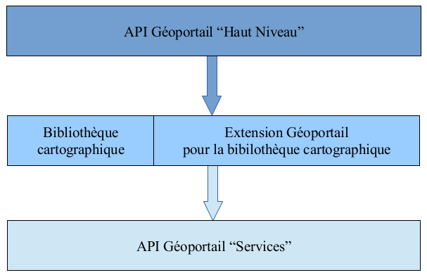

# FAQ

## Quel est le namespace du SDK ?

Le namespace lié au Kit de développement est "Gp".

## Comment s'articule le SDK avec les autres blocs de code proposés par l'IGN ? 

Le Kit de développementest un bloc de fonctions de gestion de l'initialisation et de l'interaction avec la carte. 

Ce bloc utilise une librairie cartographique et son extension Géoportail. Par défaut, le SDK utilise [Openlayers3] (http://openlayers.org/) et son [extension Géoportail](http://ignf.github.io/evolution-apigeoportail/ol3/presentation.html), qui repose elle-même sur la [bibliothèque d'accès] (http://ignf.github.io/evolution-apigeoportail/services/presentation.html) JavaScript aux ressources du Géoportail. 

Les dépendances entre ces blocs sont les suivantes.

L'interface utilisateur du SDK est indépendante de la bibliothèque cartographique sur laquelle elle s'appuie.

