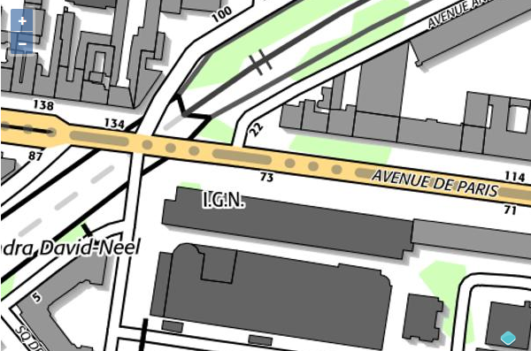

# Bibliothèque d'accès aux ressources du Géoportail

## Présentation

Les ressources du Géoportail permettent notamment :

* d'obtenir des fonds de cartes géo-localisés à des niveaux de zoom allant du monde à la rue ;
* de connaitre la position d'un nom de lieu, d'une adresse ou d'une parcelle cadastrale ;
* de connaitre l'altitude en un point donné du territoire Français ou calculer un profil altimétrique le long d'un parcours ;
* de calculer des itinéraires routiers ou piétons sur le territoire français ;
* d'effectuer des transformations de coordonnées d'un référentiel vers un autre.

La bibliothèque d'accès aux ressources de la plateforme Géoportail est une bibliothèque de fonctions javascript permettant l'utilisation de ces ressources en complément d'une solution cartographique de son choix.


## Exemples d'utilisations

L'utilisation des ressources du Géoportail est conditionnée à la possession d'une clef d'accès que l'on peut obtenir [sur le site professionnels.ign.fr](http://professionnels.ign.fr/api-web).

Une fois en possession d'une clef d'accès, l'accès aux ressources se fera simplement à l'aide de l'appel d'une fonction dédiée. 


### Connaitre la position d'une adresse


L'appel suivant de la fonction "Gp.services.geocode" permet d'obtenir la position géographique de l'adresse du 73 avenue de Paris à Saint-Mandé.


``` javascript
Gp.services.geocode({
    apiKey:"CLEF_D_ACCES",
    location : "73 avenue de Paris, Saint-Mandé",
        // la fonction suivante sera appelée à la réception de la réponse 
        // du service.
    onSuccess : function(geocodedLocations){
            // geocodedLocations contient les différentes positions possibles
            // pour l'adresse fournie avec des indicateurs de pertinence
            alert("  x: "+geocodedLocations[0].position.x+
                  "\ny: "+geocodedLocations[0].position.y+
                  "\npertinence: "+geocodedLocations[0].accuracy) ;
    }
}) ;
```

Couplé avec l'utilisation d'une bibliothèque cartographique telle qu'OpenLayers 3 ou Leaflet, on peut alors aisément centrer une carte dynamique à partir d'une adresse de la manière suivante :

``` javascript
// initialisation d'une carte OpenLayers 3 
var map= new ol.Map({  
    projection: "EPSG:4326",
    ...
}) ;

// centrage sur le 73 avenue de Paris
Gp.services.geocode({
    apiKey:"CLEF_D_ACCES",
    location : "73 avenue de Paris, Saint-Mandé",
        // la fonction suivante sera appelée à la réception de la réponse 
        // du service.
    onSuccess : function(geocodedLocations){
            map.getView().setCenter([
                geocodedLocations[0].position.x,
                geocodedLocations[0].position.y
            ]) ;
    }
}) ;
```




### Obtenir l'altitude en un point

L'appel suivant de la fonction "Gp.services.getAltitude" permet d'obtenir l'altitude aux coordonnées indiquées en longitude, latitude (x:0.2367 , y:48.0551).


``` javascript
Gp.services.getAltitude({
    apiKey: "CLE_D_ACCES",
    positions:[
        {x:0.2367,y:48.0551}
    ],
        // la fonction suivante sera appelée à la réception de la réponse 
        // du service.
    onSuccess: function(elevations){
        // affiche les informations du point fourni
        console.log(elevations[0].z);
    }
});
```


### Configurer l'affichage des couches dans une bibliothèque cartographique.

L'appel suivant à la fonction "Gp.services.getConfig" permet d'obtenir les informations d'accès et de paramétrage relatifs à la clef d'accès passée en paramètres.

``` javascript
Gp.services.getConfig({
    apiKey : "CLE_D_ACCES"
    // la fonction suivante sera appelée à la réception de la réponse 
    // du service.
    onSuccess: function(config){
        // affiche la liste des ressources accessibles avec leurs caractéristiques
        // techniques
        console.log(config.layers);
    }
}) ;

```
